EOCRC vs AOCRC Microbiome Project
================
<david.hein@utsouthwestern.edu>
2023-02-14

- <a href="#1-libraries--setup" id="toc-1-libraries--setup">1 Libraries
  &amp; Setup</a>
- <a href="#2-import-data" id="toc-2-import-data">2 Import Data</a>
- <a href="#3-raceethnicity-and-onset-analysis"
  id="toc-3-raceethnicity-and-onset-analysis">3 Race/ethnicity and onset
  analysis</a>
  - <a href="#31-set-up-phyloseq-object-ethonset"
    id="toc-31-set-up-phyloseq-object-ethonset">3.1 Set up phyloseq object
    (Eth/Onset)</a>
  - <a href="#32-differential-abundance-ethonset"
    id="toc-32-differential-abundance-ethonset">3.2 Differential Abundance
    (Eth/Onset)</a>
    - <a href="#321-da-results-ethincity-10"
      id="toc-321-da-results-ethincity-10">3.2.1 DA Results Ethincity 10%</a>
    - <a href="#322-da-results-ethincity-0"
      id="toc-322-da-results-ethincity-0">3.2.2 DA Results Ethincity 0%</a>
    - <a href="#323-da-results-onset-10"
      id="toc-323-da-results-onset-10">3.2.3 DA Results Onset 10%</a>
    - <a href="#324-da-results-onset-0" id="toc-324-da-results-onset-0">3.2.4
      DA Results Onset 0%</a>
  - <a href="#33-alpha-diversity-ethonset"
    id="toc-33-alpha-diversity-ethonset">3.3 Alpha diversity (Eth/Onset)</a>
  - <a href="#34-beta-diversity-ethonset"
    id="toc-34-beta-diversity-ethonset">3.4 Beta diversity (Eth/Onset)</a>
    - <a href="#341-compositional" id="toc-341-compositional">3.4.1
      Compositional</a>
    - <a href="#342-bray-curtis" id="toc-342-bray-curtis">3.4.2 Bray
      Curtis</a>
- <a href="#4-composite-binary-response-analysis"
  id="toc-4-composite-binary-response-analysis">4 Composite binary
  response analysis</a>
  - <a href="#41-set-up-phyloseq-response"
    id="toc-41-set-up-phyloseq-response">4.1 Set up phyloseq (response)</a>
  - <a href="#42-differential-abundance-response"
    id="toc-42-differential-abundance-response">4.2 Differential abundance
    (response)</a>
    - <a href="#421-da-results-response-10"
      id="toc-421-da-results-response-10">4.2.1 DA Results Response 10%</a>
    - <a href="#422-da-results-response-0"
      id="toc-422-da-results-response-0">4.2.2 DA Results Response 0%</a>
  - <a href="#43-alpha-diversity-response"
    id="toc-43-alpha-diversity-response">4.3 Alpha diversity (response)</a>
  - <a href="#44-beta-diversity-response"
    id="toc-44-beta-diversity-response">4.4 Beta diversity (response)</a>
    - <a href="#441-compositional-response"
      id="toc-441-compositional-response">4.4.1 Compositional (response)</a>
    - <a href="#442-bray-curtis-response"
      id="toc-442-bray-curtis-response">4.4.2 Bray-Curtis (response)</a>
- <a href="#5-figure-1-differential-expression-plot"
  id="toc-5-figure-1-differential-expression-plot">5 Figure 1 Differential
  expression Plot</a>
- <a href="#6-session-info" id="toc-6-session-info">6 Session info</a>

# 1 Libraries & Setup

``` r
library(phyloseq)
library(ANCOMBC)
library(vegan)
library(plyr)
library(microbiomeMarker)
library(ggpubr)
library(tidyverse)
library(Maaslin2)
library(ggtext)

source("helper_functions.r",local=knitr::knit_global())
set.seed(2023)
```

<br>

# 2 Import Data

``` r
selected_patients <- read.delim("selected_patients.txt")
Sanford_Nov_2022level_7_ASVs <- read.csv("Sanford_Nov_2022level_7_ASVs.csv")
```

<br>

# 3 Race/ethnicity and onset analysis

## 3.1 Set up phyloseq object (Eth/Onset)

``` r
# Filter and clean data, remove antibiotics here, make race/ethnicity and age binary
clinical_eth_age<-selected_patients%>%filter(First_Stool_Anti_Days_Before < -120 | First_Stool_Anti_Before=='n')
clinical_eth_age<-clinical_eth_age %>% select(SampleID,
                                              Age_at_Diag,
                                              Onset,
                                              Sex,
                                              RaceEth,
                                              Ethnicity,
                                              Treatment_Cat,
                                              Composite_Binary,
                                              Initial_MRI_Stage_Simple,
                                              Why_Binary)

clinical_eth_age<-clinical_eth_age %>% mutate(Onset = ifelse(Onset =="EOCRC","EOCRC","AOCRC"),Ethnicity = ifelse(Ethnicity=="nonhisp","Non-Hispanic","White-Hispanic"))

# Create phylo obj
eth_age_phylo <- build_phylo_obj(clinical_eth_age,Sanford_Nov_2022level_7_ASVs)

# Check library size 
check_library_size<-data.frame(eth_age_phylo$unfilt@otu_table)
colSums(check_library_size)
```

    ## BSample314     Nina13 BSample333     Nina62  Sample346 BSample335  Sample118 
    ##       7205      37795       3019      41768       1748       7652      25510 
    ##     Nina55 BSample336 Stanford14 Stanford12     Nina39  Sample123  Sample114 
    ##      15996      14019      50964      29341      33020      20830      10376 
    ##  Sample349     Nina33  Sample348     Nina17 BSample337     Nina69  Sample364 
    ##      58011      43092      93870      44182      15046      51789       1893 
    ##     Nina38 BSample312  Sample127  Stanford2 BSample315 BSample309 BSample316 
    ##      28551       7957      14122       4309      13644      14758       1519 
    ##     Nina63     Nina40     Nina64  Stanford6      Nina7  Sample351     Nina20 
    ##      45311      18401      46682      27334       8422      46428      34969 
    ##      Nina5 Stanford11  Sample373 BSample310     Nina56     Nina18     Nina51 
    ##      43545      34953      97230      14444       2024      15429      38319 
    ##     Nina44  Stanford8 
    ##      38223      33910

<br><br>

## 3.2 Differential Abundance (Eth/Onset)

``` r
# run ancombc on filt and unfilt sets for onset and ethnicity
ancomres_eth_age_filt_ethnicity<-run_ancom_all_levels(eth_age_phylo$filt,"Ethnicity")
ancomres_eth_age_filt_onset<-run_ancom_all_levels(eth_age_phylo$filt,"Age_at_Diag")

ancomres_eth_age_unfilt_ethnicity<-run_ancom_all_levels(eth_age_phylo$unfilt,"Ethnicity")
ancomres_eth_age_unfilt_onset<-run_ancom_all_levels(eth_age_phylo$unfilt,"Onset")

# Run MaAsLin2
masres_eth_age_filt_ethnicity <-run_mas_all_levels(eth_age_phylo$filt,"Ethnicity")
masres_eth_age_filt_onset <-run_mas_all_levels(eth_age_phylo$filt,"Age_at_Diag")

masres_eth_age_unfilt_ethnicity <-run_mas_all_levels(eth_age_phylo$unfilt,"Ethnicity")
masres_eth_age_unfilt_onset <-run_mas_all_levels(eth_age_phylo$unfilt,"Age_at_Diag")

# Combine Mas and ancom results into an easy to work with data frame
combres_eth_age_filt_ethnicity <- combine_res(masres_eth_age_filt_ethnicity,ancomres_eth_age_filt_ethnicity)
combres_eth_age_filt_onset <- combine_res(masres_eth_age_filt_onset,ancomres_eth_age_filt_onset)

combres_eth_age_unfilt_ethnicity <- combine_res(masres_eth_age_unfilt_ethnicity,ancomres_eth_age_unfilt_ethnicity)
combres_eth_age_unfilt_onset <- combine_res(masres_eth_age_unfilt_onset,ancomres_eth_age_unfilt_onset)

saveRDS(combres_eth_age_filt_ethnicity, file="completed_tests/combres_eth_age_filt_ethnicity.rds")
saveRDS(combres_eth_age_filt_onset, file="completed_tests/combres_eth_age_filt_onset.rds")
saveRDS(combres_eth_age_unfilt_ethnicity, file="completed_tests/combres_eth_age_unfilt_ethnicity.rds")

saveRDS(combres_eth_age_unfilt_onset, file="completed_tests/combres_eth_age_unfilt_onset.rds")
```

<br>

### 3.2.1 DA Results Ethincity 10%

``` r
combres_eth_age_filt_ethnicity <- readRDS(file="completed_tests/combres_eth_age_filt_ethnicity.rds")
knitr::kable(combres_eth_age_filt_ethnicity[1:20,],digits=3)
```

| taxa                                     | coef_ancom | stderr_ancom | bhcorp_ancom | coef_mas | stderr_mas | bhcorp_mas |
|:-----------------------------------------|-----------:|-------------:|-------------:|---------:|-----------:|-----------:|
| g\_\_Howardella                          |      1.755 |        0.395 |        0.003 |    2.353 |      0.542 |      0.023 |
| s\_\_ureilytica                          |      1.724 |        0.407 |        0.004 |    1.442 |      0.353 |      0.028 |
| f\_\_Prevotellaceae                      |      3.486 |        0.777 |        0.003 |    5.354 |      1.348 |      0.032 |
| g\_\_Oscillibacter_s\_\_NA               |     -1.370 |        0.405 |        0.038 |   -2.498 |      0.588 |      0.023 |
| g\_\_Oscillibacter                       |     -1.350 |        0.406 |        0.042 |   -2.498 |      0.588 |      0.023 |
| g\_\_Alloprevotella                      |      2.450 |        0.689 |        0.031 |    1.885 |      0.550 |      0.088 |
| g\_\_Alloprevotella_s\_\_NA              |      2.430 |        0.699 |        0.036 |    1.885 |      0.550 |      0.088 |
| g\_\_Catenibacterium                     |      2.002 |        0.608 |        0.042 |    2.414 |      0.684 |      0.085 |
| s\_\_mitsuokai                           |      1.982 |        0.616 |        0.049 |    2.414 |      0.684 |      0.085 |
| g\_\_Prevotella_s\_\_NA                  |      2.307 |        0.737 |        0.056 |    3.715 |      1.100 |      0.092 |
| g\_\_Prevotella_7                        |      2.595 |        0.821 |        0.053 |    3.562 |      1.086 |      0.101 |
| g\_\_Prevotella_7\_s\_\_NA               |      2.575 |        0.835 |        0.059 |    3.562 |      1.086 |      0.101 |
| g\_\_Ruminococcus                        |      2.551 |        0.640 |        0.008 |    2.545 |      0.887 |      0.184 |
| g\_\_Prevotella_9                        |      2.972 |        0.971 |        0.060 |    3.303 |      1.057 |      0.143 |
| s\_\_copri                               |      2.645 |        0.886 |        0.063 |    2.859 |      0.936 |      0.161 |
| g\_\_Prevotellaceae NK3B31 group         |      1.696 |        0.582 |        0.071 |    1.152 |      0.384 |      0.163 |
| g\_\_Prevotellaceae NK3B31 group_s\_\_NA |      1.677 |        0.583 |        0.072 |    1.152 |      0.384 |      0.163 |
| s\_\_formicigenerans                     |      1.665 |        0.486 |        0.038 |    1.682 |      0.605 |      0.212 |
| g\_\_Colidextribacter_s\_\_NA            |     -1.177 |        0.400 |        0.070 |   -1.907 |      0.669 |      0.184 |
| g\_\_Colidextribacter                    |     -1.157 |        0.404 |        0.073 |   -1.907 |      0.669 |      0.184 |

<br>

### 3.2.2 DA Results Ethincity 0%

``` r
combres_eth_age_unfilt_ethnicity <- readRDS(file="completed_tests/combres_eth_age_unfilt_ethnicity.rds")
knitr::kable(combres_eth_age_unfilt_ethnicity[1:20,],digits=3)
```

| taxa                                     | coef_ancom | stderr_ancom | bhcorp_ancom | coef_mas | stderr_mas | bhcorp_mas |
|:-----------------------------------------|-----------:|-------------:|-------------:|---------:|-----------:|-----------:|
| f\_\_Prevotellaceae                      |      3.825 |        0.742 |        0.000 |    5.633 |      1.241 |      0.028 |
| g\_\_Howardella                          |      1.748 |        0.402 |        0.006 |    2.310 |      0.539 |      0.028 |
| s\_\_ureilytica                          |      1.752 |        0.409 |        0.006 |    1.408 |      0.351 |      0.043 |
| g\_\_Catenibacterium                     |      2.235 |        0.623 |        0.050 |    2.763 |      0.688 |      0.043 |
| g\_\_Oscillibacter                       |     -1.357 |        0.417 |        0.092 |   -2.637 |      0.610 |      0.028 |
| g\_\_Oscillibacter_s\_\_NA               |     -1.341 |        0.423 |        0.099 |   -2.637 |      0.610 |      0.028 |
| g\_\_Alloprevotella                      |      2.443 |        0.699 |        0.060 |    1.846 |      0.544 |      0.174 |
| g\_\_Alloprevotella_s\_\_NA              |      2.458 |        0.708 |        0.060 |    1.846 |      0.544 |      0.174 |
| s\_\_mitsuokai                           |      2.010 |        0.633 |        0.099 |    2.399 |      0.675 |      0.143 |
| g\_\_Prevotella_s\_\_NA                  |      2.335 |        0.749 |        0.099 |    3.671 |      1.092 |      0.174 |
| g\_\_Prevotella_7\_s\_\_NA               |      2.604 |        0.842 |        0.099 |    3.528 |      1.079 |      0.205 |
| g\_\_Ruminococcus                        |      2.544 |        0.659 |        0.024 |    2.489 |      0.885 |      0.355 |
| g\_\_Prevotella_9                        |      2.965 |        0.971 |        0.108 |    3.271 |      1.045 |      0.279 |
| s\_\_copri                               |      2.673 |        0.888 |        0.109 |    2.826 |      0.928 |      0.293 |
| g\_\_Prevotellaceae NK3B31 group_s\_\_NA |      1.705 |        0.584 |        0.126 |    1.256 |      0.415 |      0.293 |
| g\_\_Prevotellaceae NK3B31 group         |      1.689 |        0.581 |        0.127 |    1.256 |      0.415 |      0.293 |
| s\_\_formicigenerans                     |      1.693 |        0.520 |        0.092 |    1.791 |      0.648 |      0.387 |
| s\_\_obeum                               |      2.304 |        0.626 |        0.041 |    2.301 |      0.901 |      0.444 |
| g\_\_Sutterella                          |      2.446 |        0.594 |        0.010 |    1.421 |      0.594 |      0.503 |
| g\_\_Sutterella_s\_\_NA                  |      2.213 |        0.664 |        0.083 |    1.707 |      0.644 |      0.433 |

<br>

### 3.2.3 DA Results Onset 10%

``` r
combres_eth_age_filt_onset <- readRDS(file="completed_tests/combres_eth_age_filt_onset.rds")
knitr::kable(combres_eth_age_filt_onset[1:20,],digits=3)
```

| taxa                                | coef_ancom | stderr_ancom | bhcorp_ancom | coef_mas | stderr_mas | bhcorp_mas |
|:------------------------------------|-----------:|-------------:|-------------:|---------:|-----------:|-----------:|
| g\_\_Alistipes_s\_\_NA              |      0.109 |        0.019 |        0.000 |    1.777 |      0.384 |      0.020 |
| g\_\_Bilophila                      |      0.072 |        0.021 |        0.117 |    1.564 |      0.484 |      0.349 |
| s\_\_wadsworthia                    |      0.071 |        0.022 |        0.130 |    1.564 |      0.484 |      0.349 |
| p\_\_Desulfobacterota               |      0.061 |        0.021 |        0.143 |    0.887 |      0.310 |      0.349 |
| c\_\_Desulfovibrionia               |      0.060 |        0.020 |        0.143 |    0.887 |      0.310 |      0.349 |
| o\_\_Veillonellales Selenomonadales |     -0.081 |        0.027 |        0.143 |   -1.563 |      0.554 |      0.349 |
| f\_\_Veillonellaceae                |     -0.083 |        0.027 |        0.143 |   -1.563 |      0.554 |      0.349 |
| s\_\_indistinctus                   |      0.049 |        0.016 |        0.143 |    0.949 |      0.311 |      0.349 |
| g\_\_NA                             |      0.042 |        0.014 |        0.143 |    0.384 |      0.139 |      0.351 |
| g\_\_NA_s\_\_NA                     |      0.041 |        0.014 |        0.143 |    0.384 |      0.139 |      0.351 |
| o\_\_Desulfovibrionales             |      0.060 |        0.021 |        0.161 |    0.887 |      0.310 |      0.349 |
| g\_\_Odoribacter                    |      0.070 |        0.026 |        0.243 |    1.711 |      0.594 |      0.349 |
| f\_\_Marinifilaceae                 |      0.066 |        0.025 |        0.259 |    1.513 |      0.495 |      0.349 |
| f\_\_Desulfovibrionaceae            |      0.058 |        0.022 |        0.259 |    0.887 |      0.310 |      0.349 |
| g\_\_Alistipes                      |      0.062 |        0.019 |        0.117 |    1.231 |      0.516 |      0.723 |
| s\_\_bifidum                        |     -0.057 |        0.016 |        0.117 |   -0.688 |      0.317 |      0.723 |
| g\_\_GCA 900066575_s\_\_NA          |     -0.034 |        0.012 |        0.143 |   -0.492 |      0.227 |      0.723 |
| g\_\_GCA 900066575                  |     -0.033 |        0.012 |        0.161 |   -0.492 |      0.227 |      0.723 |
| f\_\_Rikenellaceae                  |      0.051 |        0.018 |        0.143 |    1.053 |      0.520 |      0.747 |
| g\_\_Anaerotruncus                  |      0.046 |        0.019 |        0.444 |    0.743 |      0.319 |      0.723 |

<br>

### 3.2.4 DA Results Onset 0%

``` r
combres_eth_age_unfilt_onset <- readRDS(file="completed_tests/combres_eth_age_unfilt_onset.rds")
knitr::kable(combres_eth_age_unfilt_onset[1:20,],digits=3)
```

| taxa                                 | coef_ancom | stderr_ancom | bhcorp_ancom | coef_mas | stderr_mas | bhcorp_mas |
|:-------------------------------------|-----------:|-------------:|-------------:|---------:|-----------:|-----------:|
| g\_\_Alistipes_s\_\_NA               |     -1.904 |        0.675 |        0.938 |    1.766 |      0.383 |      0.039 |
| p\_\_Desulfobacterota                |     -0.764 |        0.534 |        0.938 |    0.874 |      0.316 |      0.628 |
| c\_\_Desulfovibrionia                |     -0.722 |        0.540 |        0.938 |    0.874 |      0.316 |      0.628 |
| o\_\_Desulfovibrionales              |     -0.690 |        0.556 |        0.938 |    0.874 |      0.316 |      0.628 |
| f\_\_Marinifilaceae                  |     -1.248 |        0.671 |        0.938 |    1.533 |      0.513 |      0.628 |
| f\_\_Desulfovibrionaceae             |     -0.665 |        0.575 |        0.938 |    0.874 |      0.316 |      0.628 |
| f\_\_Veillonellaceae                 |      1.652 |        0.695 |        0.938 |   -1.606 |      0.543 |      0.628 |
| g\_\_Odoribacter                     |     -1.342 |        0.677 |        0.938 |    1.712 |      0.595 |      0.628 |
| g\_\_Bilophila                       |     -1.065 |        0.607 |        0.938 |    1.466 |      0.455 |      0.628 |
| g\_\_NA                              |     -0.917 |        0.338 |        0.938 |    0.432 |      0.151 |      0.628 |
| s\_\_indistinctus                    |     -1.098 |        0.398 |        0.938 |    0.938 |      0.309 |      0.628 |
| s\_\_wadsworthia                     |     -1.111 |        0.655 |        0.938 |    1.550 |      0.483 |      0.628 |
| g\_\_NA_s\_\_NA                      |     -0.912 |        0.343 |        0.938 |    0.432 |      0.151 |      0.628 |
| g\_\_Coprobacillus_s\_\_NA           |     -0.111 |        0.122 |        0.938 |    0.262 |      0.090 |      0.628 |
| f\_\_Coriobacteriales Incertae Sedis |     -1.133 |        0.412 |        0.938 |    1.090 |      0.406 |      0.730 |
| o\_\_Veillonellales Selenomonadales  |      1.385 |        0.664 |        0.938 |   -1.276 |      0.515 |      0.823 |
| f\_\_Bacteroidaceae                  |     -0.827 |        0.510 |        0.938 |    0.777 |      0.355 |      0.823 |
| f\_\_Rikenellaceae                   |     -0.717 |        0.581 |        0.938 |    1.073 |      0.518 |      0.823 |
| g\_\_Enorma                          |     -0.341 |        0.232 |        0.938 |    0.112 |      0.053 |      0.823 |
| g\_\_NA                              |     -0.929 |        0.416 |        0.938 |    0.884 |      0.413 |      0.823 |

<br><br>

## 3.3 Alpha diversity (Eth/Onset)

``` r
alpha_meas = c("Chao1", "Shannon", "Simpson","ACE")

p<-plot_richness(eth_age_phylo$unfilt, "Onset", measures=alpha_meas)
p + geom_boxplot(data=p$data, aes(x=Onset, y=value),color="darkblue", alpha=0.1)+
      ggtitle("Onset Alpha Diversity") + theme_test() + xlab("")
```

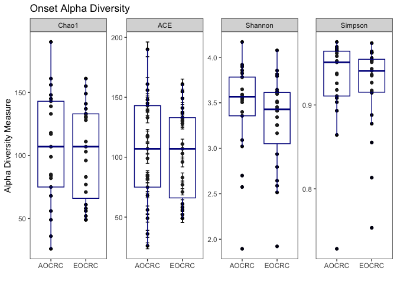<!-- -->

``` r
p<-plot_richness(eth_age_phylo$unfilt, "Ethnicity", measures=alpha_meas)
p + geom_boxplot(data=p$data, aes(x=Ethnicity, y=value),color="darkblue", alpha=0.1)+
      ggtitle("Race/Ethnicity Alpha Diversity") + theme_test() +
      scale_x_discrete(labels=c("Non-Hispanic" = "Non\nHispanic", "White-Hispanic" = "White\nHispanic" )) + xlab("")
```

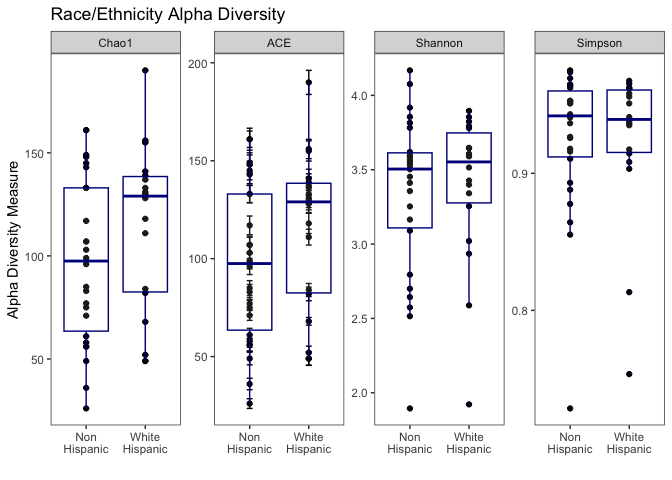<!-- -->
<br><br>

## 3.4 Beta diversity (Eth/Onset)

### 3.4.1 Compositional

``` r
# get clr transform
eth_age_phylo_clr <- microbiome::transform(eth_age_phylo$unfilt,"clr")
a<-eth_age_phylo$filt

# run PCA on clr transformed data. PCA uses euclidean distance 
ord_clr <- phyloseq::ordinate(eth_age_phylo_clr,"RDA")
ord_plot_df<-phyloseq::plot_ordination(a, ord_clr, type="samples", color="Ethnicity",justDF=TRUE)  

# check out variance explained by each PC
phyloseq::plot_scree(ord_clr) + geom_bar(stat="identity", fill = "blue") +
                                  labs(x = "\nAxis", y = "Proportion of Variance\n") + 
                                  ggtitle("Scree Plot Race/Ethnicity and Onset Compositional")
```

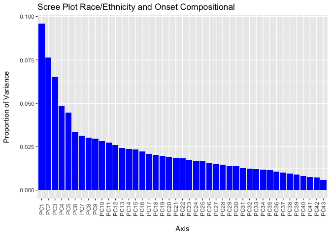<!-- -->

``` r
# Generate Aitchison distance matrix
clr_dist_matrix <- phyloseq::distance(eth_age_phylo_clr, method = "euclidean")

# ADONIS test
vegan::adonis2(clr_dist_matrix ~ clinical_eth_age$Ethnicity,permutations = 100000)
```

    ## Permutation test for adonis under reduced model
    ## Terms added sequentially (first to last)
    ## Permutation: free
    ## Number of permutations: 1e+05
    ## 
    ## vegan::adonis2(formula = clr_dist_matrix ~ clinical_eth_age$Ethnicity, permutations = 1e+05)
    ##                            Df SumOfSqs      R2      F  Pr(>F)    
    ## clinical_eth_age$Ethnicity  1     3347 0.04682 2.0631 0.00012 ***
    ## Residual                   42    68134 0.95318                   
    ## Total                      43    71481 1.00000                   
    ## ---
    ## Signif. codes:  0 '***' 0.001 '**' 0.01 '*' 0.05 '.' 0.1 ' ' 1

``` r
dispr<-vegan::betadisper(clr_dist_matrix , clinical_eth_age$Ethnicity)
permutest(dispr,permutations = 100000)
```

    ## 
    ## Permutation test for homogeneity of multivariate dispersions
    ## Permutation: free
    ## Number of permutations: 1e+05
    ## 
    ## Response: Distances
    ##           Df Sum Sq Mean Sq      F N.Perm Pr(>F)
    ## Groups     1  29.86  29.863 1.8716  1e+05 0.1794
    ## Residuals 42 670.13  15.955

``` r
vegan::adonis2(clr_dist_matrix ~ clinical_eth_age$Onset,permutations = 100000)
```

    ## Permutation test for adonis under reduced model
    ## Terms added sequentially (first to last)
    ## Permutation: free
    ## Number of permutations: 1e+05
    ## 
    ## vegan::adonis2(formula = clr_dist_matrix ~ clinical_eth_age$Onset, permutations = 1e+05)
    ##                        Df SumOfSqs      R2      F Pr(>F)
    ## clinical_eth_age$Onset  1     1613 0.02257 0.9699 0.5116
    ## Residual               42    69867 0.97743              
    ## Total                  43    71481 1.00000

``` r
dispr<-vegan::betadisper(clr_dist_matrix , clinical_eth_age$Onset)
permutest(dispr,permutations = 100000)
```

    ## 
    ## Permutation test for homogeneity of multivariate dispersions
    ## Permutation: free
    ## Number of permutations: 1e+05
    ## 
    ## Response: Distances
    ##           Df Sum Sq Mean Sq      F N.Perm Pr(>F)
    ## Groups     1   0.12  0.1216 0.0079  1e+05 0.9303
    ## Residuals 42 648.31 15.4359

``` r
# Plot compositional PC with stat ellipse, the stat ellipse is a 95% conf interval from a multivariate t distribution
ggplot(ord_plot_df,aes(x=PC1,y=PC2,color=Ethnicity)) + geom_point(size=2.8) +
                                                        stat_ellipse(linetype=2,linewidth=0.8) +
                                                        ggtitle("Aitchison Distance Ethnicity") +
                                                        theme_test() + 
                                                        theme(legend.position = "bottom",text = element_text(size=16)) +
                                                        annotate("text",x=6,y=-4.8, label="PERMANOVA Results:\nseparation p<0.001\nR^2=0.047\ndispersion p=0.179",size=3,lineheight=0.8)+
                                                        xlab("PC1 (9.6%)")+ylab("PC2 (7.6%)")+
                                                        scale_color_manual(values=c("#d6604d","#4393c3"))
```

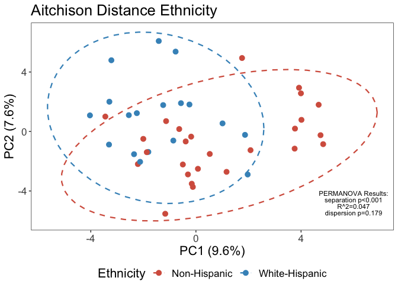<!-- -->

``` r
ggplot(ord_plot_df,aes(x=PC1,y=PC2,color=Onset)) + geom_point(size=2.8)+stat_ellipse(linetype=2,linewidth=0.8) +
                                                    ggtitle("Aitchison Distance Onset")+
                                                    theme_test()+theme(legend.position = "bottom",text = element_text(size=16))+
                                                    annotate("text",x=5.8,y=-5.2, label="PERMANOVA Results:\nseparation p=0.512\nR^2=0.023\ndispersion p=0.931",size=3,lineheight=0.8)+
                                                    scale_color_manual(values=c("#bf812d","#35978f"))
```

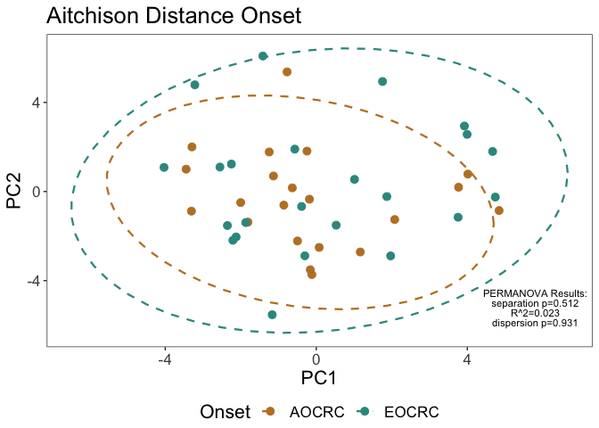<!-- -->
<br><br>

### 3.4.2 Bray Curtis

``` r
# tss normalization
eth_age_phylo_tss <- microbiome::transform(eth_age_phylo$filt,"compositional")
# bray curtis dissimilarity
ord_tss <- phyloseq::ordinate(eth_age_phylo_tss,distance="bray",method="PCoA")
ord_plot_df2 <- phyloseq::plot_ordination(a, ord_tss, type="samples", color="Ethnicity",justDF=TRUE)  

# check out variance explained by each PC
phyloseq::plot_scree(ord_tss) + geom_bar(stat="identity", fill = "blue") +
                                labs(x = "\nAxis", y = "Proportion of Variance\n") + 
                                ggtitle("Scree Plot Race/Ethnicity and Onset Bray-Curtis")
```

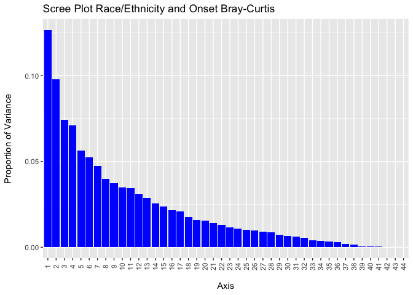<!-- -->

``` r
# ADONIS tests 
bray_dist_matrix <- phyloseq::distance(eth_age_phylo_tss, method = "bray")
?phyloseq::distance

vegan::adonis2(bray_dist_matrix ~ clinical_eth_age$Ethnicity,permutations = 100000)
```

    ## Permutation test for adonis under reduced model
    ## Terms added sequentially (first to last)
    ## Permutation: free
    ## Number of permutations: 1e+05
    ## 
    ## vegan::adonis2(formula = bray_dist_matrix ~ clinical_eth_age$Ethnicity, permutations = 1e+05)
    ##                            Df SumOfSqs      R2      F  Pr(>F)   
    ## clinical_eth_age$Ethnicity  1   0.5474 0.04464 1.9625 0.00307 **
    ## Residual                   42  11.7149 0.95536                  
    ## Total                      43  12.2623 1.00000                  
    ## ---
    ## Signif. codes:  0 '***' 0.001 '**' 0.01 '*' 0.05 '.' 0.1 ' ' 1

``` r
dispr <- vegan::betadisper(bray_dist_matrix , clinical_eth_age$Ethnicity)
permutest(dispr,permutations = 100000)
```

    ## 
    ## Permutation test for homogeneity of multivariate dispersions
    ## Permutation: free
    ## Number of permutations: 1e+05
    ## 
    ## Response: Distances
    ##           Df   Sum Sq   Mean Sq      F N.Perm Pr(>F)
    ## Groups     1 0.000242 0.0002419 0.0352  1e+05 0.8533
    ## Residuals 42 0.288319 0.0068647

``` r
vegan::adonis2(bray_dist_matrix ~ clinical_eth_age$Onset,permutations = 100000)
```

    ## Permutation test for adonis under reduced model
    ## Terms added sequentially (first to last)
    ## Permutation: free
    ## Number of permutations: 1e+05
    ## 
    ## vegan::adonis2(formula = bray_dist_matrix ~ clinical_eth_age$Onset, permutations = 1e+05)
    ##                        Df SumOfSqs      R2      F Pr(>F)
    ## clinical_eth_age$Onset  1   0.2833 0.02311 0.9935 0.4574
    ## Residual               42  11.9789 0.97689              
    ## Total                  43  12.2623 1.00000

``` r
dispr <- vegan::betadisper(bray_dist_matrix , clinical_eth_age$Onset)
permutest(dispr,permutations = 10000)
```

    ## 
    ## Permutation test for homogeneity of multivariate dispersions
    ## Permutation: free
    ## Number of permutations: 10000
    ## 
    ## Response: Distances
    ##           Df   Sum Sq  Mean Sq      F N.Perm Pr(>F)
    ## Groups     1 0.013595 0.013595 2.1888  10000 0.1522
    ## Residuals 42 0.260863 0.006211

``` r
# plotting w/ 95% conf interval 
ggplot(ord_plot_df2,aes(x=Axis.1,y=Axis.2,color=Ethnicity)) + geom_point(size=2.8) + 
                                                              stat_ellipse(linetype=2,linewidth=0.8)+ 
                                                              ggtitle("Bray-Curtis Dissimilarity Ethnicity") +
                                                              theme_test()+theme(legend.position = "bottom",text = element_text(size=16)) +
                                                              annotate("text",x=0.48,y=-.35, label="PERMANOVA Results:\nseparation p=0.003\nR^2=0.045\ndispersion p=0.854",size=3,lineheight=0.8) +
                                                              scale_color_manual(values=c("#d6604d","#4393c3")) + xlab("PC1 (12.7%)") + ylab("PC2 (9.8%)")
```

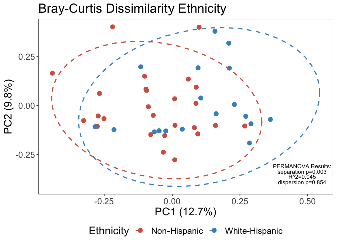<!-- -->

``` r
ggplot(ord_plot_df2,aes(x=Axis.1,y=Axis.2,color=Onset)) + geom_point(size=2.8) + 
                                                          stat_ellipse(linetype=2,linewidth=0.8) + 
                                                          ggtitle("Bray-Curtis Dissimilarity Onset")+
                                                          theme_test()+theme(legend.position = "bottom",text = element_text(size=16))+
                                                          annotate("text",x=0.4,y=.35, label="PERMANOVA Results:\nseparation p=0.458\nR^2=0.023\ndispersion p=0.151",size=3,lineheight=0.8)+
                                                          scale_color_manual(values=c("#bf812d","#35978f")) + xlab("PC1 (12.7%)") + ylab("PC2 (9.8%)")
```

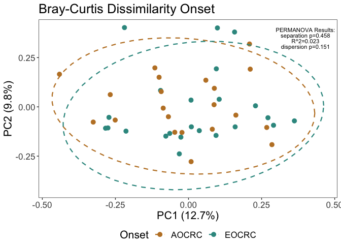<!-- -->

``` r
#ggsave(plot=last_plot(),file="alpha_diversity.tiff",height=4,width=8)
#ggsave(plot=last_plot(),file="ethnicity_beta_atchison.tiff",height=6,width=8)
```

<br><br>

# 4 Composite binary response analysis

## 4.1 Set up phyloseq (response)

``` r
clinical_resp <- selected_patients
clinical_resp <- clinical_resp %>% select(SampleID,
                                        Age_at_Diag,
                                        Onset,
                                        Sex,
                                        RaceEth,
                                        Ethnicity,
                                        Composite_Binary,
                                        Why_Binary,
                                        First_Stool_Anti_Before,
                                        Initial_MRI_Stage_Simple,
                                        Treatment_Cat) %>% filter(!is.na(Composite_Binary))

clinical_resp<-clinical_resp %>% mutate(Composite_Binary = ifelse(Composite_Binary == 1,"Complete/Near Complete","Partial/Poor"))

#table(clinical_resp$Why_Binary,clinical_resp$RaceEth)
#table(clinical_resp$Composite_Binary)
#summary(clinical_resp$Age_at_Diag)

# Create phylo obj
resp_phylo <- build_phylo_obj(clinical_resp,Sanford_Nov_2022level_7_ASVs)
```

<br><br>

## 4.2 Differential abundance (response)

``` r
# run ancombc on filt and unfilt 
ancomres_resp_filt_respb <- run_ancom_all_levels(resp_phylo$filt,"Composite_Binary")
ancomres_resp_unfilt_respb <- run_ancom_all_levels(resp_phylo$unfilt,"Composite_Binary")

# Run MaAsLin2
masres_resp_filt_respb <- run_mas_all_levels(resp_phylo$filt,"Composite_Binary")
masres_resp_unfilt_respb <- run_mas_all_levels(resp_phylo$unfilt,"Composite_Binary")

# Combine Mas and ancombc results into an easy to work with data frame
combres_resp_filt_respb <- combine_res(masres_resp_filt_respb,ancomres_resp_filt_respb)
combres_resp_unfilt_respb <- combine_res(masres_resp_unfilt_respb,ancomres_resp_unfilt_respb)

saveRDS(combres_resp_filt_respb, file="completed_tests/combres_resp_filt_respb.rds")
saveRDS(combres_resp_unfilt_respb, file="completed_tests/combres_resp_unfilt_respb.rds")
```

<br>

### 4.2.1 DA Results Response 10%

``` r
combres_resp_filt_respb <- readRDS(file="completed_tests/combres_resp_filt_respb.rds")
knitr::kable(combres_resp_filt_respb[1:20,],digits=3)
```

| taxa                                 | coef_ancom | stderr_ancom | bhcorp_ancom | coef_mas | stderr_mas | bhcorp_mas |
|:-------------------------------------|-----------:|-------------:|-------------:|---------:|-----------:|-----------:|
| g\_\_Bacteroides_s\_\_caccae         |      2.154 |        0.541 |        0.040 |    2.688 |      0.699 |      0.181 |
| g\_\_Anaerococcus                    |      1.039 |        0.368 |        0.349 |    1.689 |      0.541 |      0.552 |
| s\_\_vaginalis                       |      1.029 |        0.366 |        0.349 |    1.689 |      0.541 |      0.552 |
| c\_\_Bacilli                         |      1.124 |        0.414 |        0.349 |    1.496 |      0.590 |      0.562 |
| c\_\_Negativicutes                   |      0.862 |        0.354 |        0.349 |    0.966 |      0.483 |      0.562 |
| o\_\_Clostridia UCG 014              |     -1.422 |        0.578 |        0.349 |   -1.724 |      0.871 |      0.562 |
| o\_\_Acidaminococcales               |      1.838 |        0.698 |        0.349 |    2.713 |      1.087 |      0.562 |
| f\_\_Erysipelotrichaceae             |      1.250 |        0.508 |        0.349 |    1.787 |      0.820 |      0.562 |
| f\_\_Streptococcaceae                |      1.132 |        0.469 |        0.349 |    1.477 |      0.741 |      0.562 |
| f\_\_Family XI                       |      1.485 |        0.523 |        0.349 |    2.037 |      0.911 |      0.562 |
| f\_\_Acidaminococcaceae              |      2.028 |        0.697 |        0.349 |    2.713 |      1.087 |      0.562 |
| g\_\_Prevotella                      |      1.892 |        0.716 |        0.349 |    2.893 |      1.241 |      0.562 |
| g\_\_Lachnospiraceae UCG 010         |      1.126 |        0.436 |        0.349 |    1.322 |      0.669 |      0.562 |
| g\_\_Mogibacterium                   |      1.040 |        0.413 |        0.349 |    1.054 |      0.453 |      0.562 |
| g\_\_Parasutterella                  |     -1.684 |        0.638 |        0.349 |   -2.459 |      0.910 |      0.562 |
| s\_\_uniformis                       |      1.418 |        0.572 |        0.349 |    1.930 |      0.918 |      0.562 |
| g\_\_Alistipes_s\_\_finegoldii       |      1.280 |        0.511 |        0.349 |    1.136 |      0.528 |      0.562 |
| s\_\_obesi                           |      1.167 |        0.382 |        0.349 |    1.445 |      0.556 |      0.562 |
| s\_\_formicigenerans                 |      1.405 |        0.454 |        0.349 |    1.540 |      0.545 |      0.562 |
| g\_\_Lachnospiraceae UCG 010_s\_\_NA |      1.116 |        0.439 |        0.349 |    1.322 |      0.669 |      0.562 |

<br>

### 4.2.2 DA Results Response 0%

``` r
combres_resp_unfilt_respb <- readRDS(file="completed_tests/combres_resp_unfilt_respb.rds")
knitr::kable(combres_resp_unfilt_respb[1:20,],digits=3)
```

| taxa                                     | coef_ancom | stderr_ancom | bhcorp_ancom | coef_mas | stderr_mas | bhcorp_mas |
|:-----------------------------------------|-----------:|-------------:|-------------:|---------:|-----------:|-----------:|
| g\_\_Bacteroides_s\_\_caccae             |      2.308 |        0.561 |        0.042 |    2.764 |      0.715 |      0.331 |
| s\_\_obesi                               |      1.320 |        0.395 |        0.301 |    1.453 |      0.555 |      0.628 |
| s\_\_vaginalis                           |      1.183 |        0.353 |        0.301 |    1.669 |      0.528 |      0.628 |
| c\_\_Bacilli                             |      1.278 |        0.403 |        0.331 |    1.308 |      0.547 |      0.628 |
| s\_\_formicigenerans                     |      1.559 |        0.487 |        0.331 |    1.657 |      0.584 |      0.628 |
| o\_\_Acidaminococcales                   |      2.168 |        0.697 |        0.341 |    2.714 |      1.083 |      0.628 |
| f\_\_Acidaminococcaceae                  |      2.135 |        0.699 |        0.356 |    2.714 |      1.083 |      0.628 |
| f\_\_Family XI                           |      1.556 |        0.534 |        0.469 |    2.094 |      0.937 |      0.628 |
| g\_\_Lachnospiraceae UCG 010             |      1.252 |        0.453 |        0.469 |    1.320 |      0.666 |      0.628 |
| g\_\_Mogibacterium                       |      1.171 |        0.411 |        0.469 |    1.080 |      0.452 |      0.628 |
| g\_\_Anaerococcus                        |      1.105 |        0.401 |        0.469 |    1.552 |      0.610 |      0.628 |
| g\_\_Bacteroides_s\_\_intestinalis       |      1.020 |        0.368 |        0.469 |    0.877 |      0.373 |      0.628 |
| g\_\_Lachnospiraceae UCG 010_s\_\_NA     |      1.270 |        0.462 |        0.469 |    1.320 |      0.666 |      0.628 |
| g\_\_Mogibacterium_s\_\_NA               |      1.184 |        0.415 |        0.469 |    1.074 |      0.451 |      0.628 |
| c\_\_Negativicutes                       |      0.969 |        0.359 |        0.501 |    0.702 |      0.466 |      0.628 |
| o\_\_Erysipelotrichales                  |      1.263 |        0.480 |        0.501 |    1.404 |      0.700 |      0.628 |
| o\_\_Peptostreptococcales Tissierellales |      1.261 |        0.482 |        0.501 |    1.387 |      0.680 |      0.628 |
| s\_\_uniformis                           |      1.572 |        0.603 |        0.501 |    1.910 |      0.915 |      0.628 |
| g\_\_Alistipes_s\_\_finegoldii           |      1.433 |        0.536 |        0.501 |    1.214 |      0.573 |      0.628 |
| s\_\_catus                               |      1.269 |        0.481 |        0.501 |    1.469 |      0.757 |      0.628 |

<br><br>

## 4.3 Alpha diversity (response)

``` r
alpha_meas = c("Chao1", "Shannon", "Simpson","ACE")
p <- plot_richness(resp_phylo$filt, "Composite_Binary", measures=alpha_meas) 
p + geom_boxplot(data=p$data, aes(x=Composite_Binary, y=value),color="darkblue", alpha=0.1) + 
      ggtitle("Binary Response Alpha Diversity") + 
      stat_compare_means(method="wilcox.test",aes(label = ..p.signif..)) + 
      theme_test() + scale_x_discrete(labels=c("Complete/Near Complete" = "Complete/\nNear Complete", "Partial/Poor" = "Partial/\nPoor")) + xlab("")
```

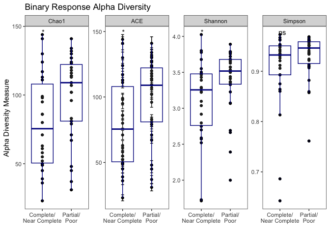<!-- -->
<br><br>

## 4.4 Beta diversity (response)

### 4.4.1 Compositional (response)

``` r
# clr transform
resp_phylo_clr <- microbiome::transform(resp_phylo$filt,"clr")
a_resp<-resp_phylo$filt

# pca
ord_clr_resp <- phyloseq::ordinate(resp_phylo_clr,"RDA")
ord_plot_df_resp <- phyloseq::plot_ordination(a_resp, ord_clr_resp, type="samples", color="Composite_Binary",justDF=TRUE)  

# check variance on pcs
phyloseq::plot_scree(ord_clr_resp) + 
  geom_bar(stat="identity", fill = "blue") +
  labs(x = "\nAxis", y = "Proportion of Variance\n") + ggtitle("Scree Plot Response Compositional")
```

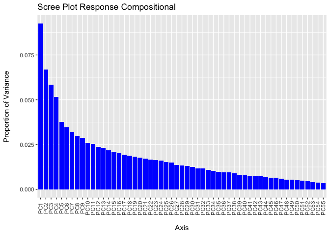<!-- -->

``` r
#Generate distance matrix
clr_dist_matrix_resp <- phyloseq::distance(resp_phylo_clr, method = "euclidean")

# PERMANOVA test
vegan::adonis2(clr_dist_matrix_resp ~ clinical_resp$Composite_Binary,permutations = 100000)
```

    ## Permutation test for adonis under reduced model
    ## Terms added sequentially (first to last)
    ## Permutation: free
    ## Number of permutations: 1e+05
    ## 
    ## vegan::adonis2(formula = clr_dist_matrix_resp ~ clinical_resp$Composite_Binary, permutations = 1e+05)
    ##                                Df SumOfSqs      R2      F Pr(>F)
    ## clinical_resp$Composite_Binary  1     1457 0.01931 1.0634 0.3078
    ## Residual                       54    73983 0.98069              
    ## Total                          55    75440 1.00000

``` r
dispr<-vegan::betadisper(clr_dist_matrix_resp ,  clinical_resp$Composite_Binary)
permutest(dispr,permutations = 100000)
```

    ## 
    ## Permutation test for homogeneity of multivariate dispersions
    ## Permutation: free
    ## Number of permutations: 1e+05
    ## 
    ## Response: Distances
    ##           Df Sum Sq Mean Sq      F N.Perm Pr(>F)
    ## Groups     1  14.45  14.450 1.3338  1e+05 0.2549
    ## Residuals 54 585.04  10.834

``` r
ggplot(ord_plot_df_resp,aes(x=PC1,y=PC2,color=Composite_Binary)) + geom_point(size=2.8) + 
                                                                    stat_ellipse(linetype=2,linewidth=0.8) +
                                                                    ggtitle("Aitchison Distance Composite Binary") +
                                                                    theme_test()+theme(legend.position = "bottom",text = element_text(size=16)) +
                                                                    xlab("PC1 (9.3%)")+ylab("PC2 (6.7%)") +
                                                                    scale_color_manual(values=c("#e08214","#8073ac")) +
                                                                    annotate("text",x=5,y=5.8, label="PERMANOVA Results:\nseparation p=0.308\nR^2=0.019\ndispersion p=0.257",size=3,lineheight=0.8)
```

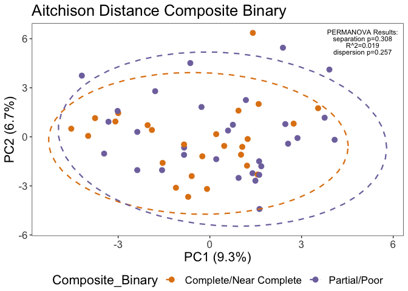<!-- -->
<br><br>

### 4.4.2 Bray-Curtis (response)

``` r
# pcoa on bray curtis diss
resp_phylo_tss <- microbiome::transform(resp_phylo$filt,"compositional")
ord_tss_resp <- phyloseq::ordinate(resp_phylo_tss,distance="bray",method="PCoA")
ord_plot_df2_resp<-phyloseq::plot_ordination(a_resp, ord_tss_resp, type="samples", color="Composite_Binary",justDF=TRUE)  

phyloseq::plot_scree(ord_tss_resp) + 
  geom_bar(stat="identity", fill = "blue") +
  labs(x = "\nAxis", y = "Proportion of Variance\n")+ggtitle("Scree Plot Response Compositional")
```

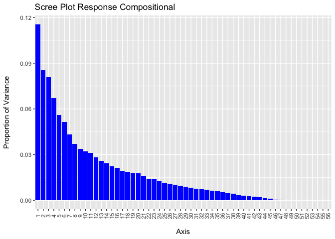<!-- -->

``` r
# PERMANOVA
bray_dist_matrix_resp <- phyloseq::distance(resp_phylo_tss, method = "bray")
vegan::adonis2(bray_dist_matrix_resp ~ clinical_resp$Composite_Binary,permutations = 100000)
```

    ## Permutation test for adonis under reduced model
    ## Terms added sequentially (first to last)
    ## Permutation: free
    ## Number of permutations: 1e+05
    ## 
    ## vegan::adonis2(formula = bray_dist_matrix_resp ~ clinical_resp$Composite_Binary, permutations = 1e+05)
    ##                                Df SumOfSqs      R2      F Pr(>F)
    ## clinical_resp$Composite_Binary  1   0.3546 0.02225 1.2286 0.1668
    ## Residual                       54  15.5844 0.97775              
    ## Total                          55  15.9389 1.00000

``` r
dispr<-vegan::betadisper(bray_dist_matrix_resp ,  clinical_resp$Composite_Binary)
permutest(dispr,permutations = 100000)
```

    ## 
    ## Permutation test for homogeneity of multivariate dispersions
    ## Permutation: free
    ## Number of permutations: 1e+05
    ## 
    ## Response: Distances
    ##           Df  Sum Sq   Mean Sq      F N.Perm Pr(>F)
    ## Groups     1 0.00361 0.0036063 0.5132  1e+05 0.4768
    ## Residuals 54 0.37948 0.0070275

``` r
# plot w/95% 
ggplot(ord_plot_df2_resp,aes(x=Axis.1,y=Axis.2,color=Composite_Binary))+geom_point(size=2.8)+
                                                                        stat_ellipse(linetype=2,linewidth=0.8)+
                                                                        ggtitle("Bray-Curtis Dissimilarity Composite Binary")+
                                                                        theme_test()+theme(legend.position = "bottom",text = element_text(size=16))+
                                                                        annotate("text",x=.45,y=-.3, label="PERMANOVA Results:\nseparation p=0.170\nR^2=0.022\ndispersion p=0.477",size=3,lineheight=0.8)+
                                                                        xlab("PC1 (11.6%)")+ylab("PC2 (8.5%)")+
                                                                        scale_color_manual(values=c("#e08214","#8073ac"))
```

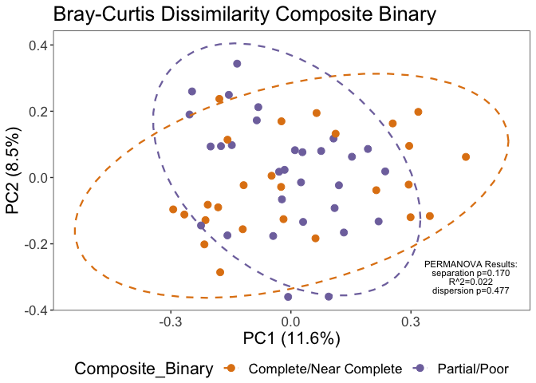<!-- -->

``` r
#ggsave(plot=last_plot(),file="response_beta_bray.tiff",height=6,width=8)
```

<br><br>

# 5 Figure 1 Differential expression Plot

``` r
# Now the stylized taxa names are edited manually in excel and then imported back into R
  # Used to make the final table used for the figure in R, but it required a TON of code, much more practical to just add the needed edits in excel
graph_df_with_stylized_taxa <- read_delim("figure1_data_with_stylized_taxa_new.txt", delim = "\t", escape_double = FALSE, trim_ws = TRUE)
```

    ## Rows: 14 Columns: 9
    ## ── Column specification ────────────────────────────────────────────────────────
    ## Delimiter: "\t"
    ## chr (1): styled_taxa
    ## dbl (8): Log FC ANCOMBC, Log FC MaAsLin2, sdancom, sdmas, pval_ancom, pval_m...
    ## 
    ## ℹ Use `spec()` to retrieve the full column specification for this data.
    ## ℹ Specify the column types or set `show_col_types = FALSE` to quiet this message.

``` r
# pivot so that each line in the dataframe is its own bar in the figure
graph_df_final <- graph_df_with_stylized_taxa %>% pivot_longer(cols = 2:3, names_to = "fc_type", values_to = "Log FC" )
graph_df_final <- graph_df_final %>% pivot_longer(cols = 2:3, names_to = "se_type", values_to = "Standard Error" )
graph_df_final <- graph_df_final%>%select(-pval_ancom,-pval_mas)

# filter out incorrect matches of LFC and SE
graph_df_final <- graph_df_final%>%filter( !(str_detect(se_type,"mas") & str_detect(fc_type,"ANC")) )
graph_df_final <- graph_df_final%>%filter( !(str_detect(se_type,"anc") & str_detect(fc_type,"Ma")) )

# add in decrease or increase for fill color
graph_df_final <- graph_df_final %>% mutate(fc_type = ifelse(`Log FC` < 0, paste0(fc_type,"decrease"), paste0(fc_type,'increase')))

# Order by ancombc fold change
graph_df_final$fc_type = factor(graph_df_final$fc_type,levels = c("Log FC MaAsLin2decrease","Log FC ANCOMBCdecrease","Log FC MaAsLin2increase","Log FC ANCOMBCincrease"))
subset_re <- graph_df_final%>%filter(se_type=="sdancom")
subset_re$styled_taxa = with(subset_re,reorder(styled_taxa,`Log FC`))
graph_df_final$styled_taxa = factor(graph_df_final$styled_taxa,levels = levels(subset_re$styled_taxa))

ggplot(graph_df_final,aes(fill=fc_type,y=`Log FC`,x=styled_taxa))+
          geom_bar(width=0.7,position=position_dodge(0.7),stat="identity")+
          geom_errorbar(aes(ymin=`Log FC`,ymax=ifelse(`Log FC`>0,`Log FC`+2*`Standard Error`,`Log FC`-2*`Standard Error`)),
                        width=0.2,position = position_dodge(0.7),color="#525252",linewidth=0.2)+
          coord_flip()+   
          scale_fill_manual(values=c("#f4a582","#d6604d","#92c5de","#4393c3"))+
          theme_bw()+
          theme( # remove the vertical grid lines
           panel.grid.major.x = element_blank() ,
           panel.grid.minor.x = element_blank(),
           # explicitly set the horizontal lines (or they will disappear too)
           panel.grid.major.y = element_line( size=.04, color="black") ,legend.position = 'none',legend.title = element_blank(),
           axis.text.y = element_markdown(),
           axis.title.y = element_blank(),
           text=element_text(size=14),
           axis.text.x = element_text(size = 11))+
          guides(fill=guide_legend(nrow=2,byrow=TRUE))+
          ylab("Log Fold Change")+
          scale_y_continuous(breaks=seq(-6,8,2),limits = c(-6.5,9))
```

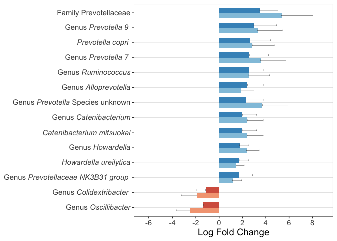<!-- -->

``` r
#ggsave(plot=last_plot(),file="figure1a.tiff",width = 10,height=8)
```

<br><br>

# 6 Session info

``` r
sessionInfo()
```

    ## R version 4.2.1 (2022-06-23)
    ## Platform: x86_64-apple-darwin17.0 (64-bit)
    ## Running under: macOS Big Sur ... 10.16
    ## 
    ## Matrix products: default
    ## BLAS:   /Library/Frameworks/R.framework/Versions/4.2/Resources/lib/libRblas.0.dylib
    ## LAPACK: /Library/Frameworks/R.framework/Versions/4.2/Resources/lib/libRlapack.dylib
    ## 
    ## locale:
    ## [1] en_US.UTF-8/en_US.UTF-8/en_US.UTF-8/C/en_US.UTF-8/en_US.UTF-8
    ## 
    ## attached base packages:
    ## [1] stats     graphics  grDevices utils     datasets  methods   base     
    ## 
    ## other attached packages:
    ##  [1] ggtext_0.1.2           Maaslin2_1.12.0        forcats_0.5.2         
    ##  [4] stringr_1.5.0          dplyr_1.0.10           purrr_0.3.5           
    ##  [7] readr_2.1.3            tidyr_1.2.1            tibble_3.1.8          
    ## [10] tidyverse_1.3.2        ggpubr_0.5.0           ggplot2_3.4.0         
    ## [13] microbiomeMarker_1.4.0 plyr_1.8.8             vegan_2.6-4           
    ## [16] lattice_0.20-45        permute_0.9-7          ANCOMBC_2.0.2         
    ## [19] phyloseq_1.42.0       
    ## 
    ## loaded via a namespace (and not attached):
    ##   [1] estimability_1.4.1             coda_0.19-4                   
    ##   [3] bit64_4.0.5                    knitr_1.41                    
    ##   [5] irlba_2.3.5.1                  multcomp_1.4-20               
    ##   [7] DelayedArray_0.24.0            data.table_1.14.6             
    ##   [9] rpart_4.1.19                   KEGGREST_1.38.0               
    ##  [11] RCurl_1.98-1.9                 doParallel_1.0.17             
    ##  [13] generics_0.1.3                 BiocGenerics_0.44.0           
    ##  [15] ScaledMatrix_1.6.0             microbiome_1.20.0             
    ##  [17] TH.data_1.1-1                  RSQLite_2.2.20                
    ##  [19] commonmark_1.8.1               proxy_0.4-27                  
    ##  [21] tzdb_0.3.0                     bit_4.0.5                     
    ##  [23] xml2_1.3.3                     lubridate_1.9.0               
    ##  [25] SummarizedExperiment_1.28.0    assertthat_0.2.1              
    ##  [27] DirichletMultinomial_1.40.0    gargle_1.2.1                  
    ##  [29] viridis_0.6.2                  xfun_0.36                     
    ##  [31] hms_1.1.2                      evaluate_0.19                 
    ##  [33] DEoptimR_1.0-11                fansi_1.0.3                   
    ##  [35] dbplyr_2.2.1                   caTools_1.18.2                
    ##  [37] readxl_1.4.1                   mia_1.6.0                     
    ##  [39] igraph_1.3.5                   DBI_1.1.3                     
    ##  [41] geneplotter_1.76.0             htmlwidgets_1.6.1             
    ##  [43] googledrive_2.0.0              stats4_4.2.1                  
    ##  [45] ellipsis_0.3.2                 Rmpfr_0.8-9                   
    ##  [47] CVXR_1.0-11                    backports_1.4.1               
    ##  [49] energy_1.7-11                  markdown_1.4                  
    ##  [51] annotate_1.76.0                deldir_1.0-6                  
    ##  [53] sparseMatrixStats_1.10.0       MatrixGenerics_1.10.0         
    ##  [55] vctrs_0.5.1                    SingleCellExperiment_1.20.0   
    ##  [57] Biobase_2.58.0                 abind_1.4-5                   
    ##  [59] cachem_1.0.6                   withr_2.5.0                   
    ##  [61] robustbase_0.95-0              vroom_1.6.0                   
    ##  [63] checkmate_2.1.0                emmeans_1.8.3                 
    ##  [65] treeio_1.22.0                  MultiAssayExperiment_1.24.0   
    ##  [67] getopt_1.20.3                  cluster_2.1.4                 
    ##  [69] gsl_2.1-7.1                    ape_5.6-2                     
    ##  [71] lazyeval_0.2.2                 crayon_1.5.2                  
    ##  [73] TreeSummarizedExperiment_2.6.0 labeling_0.4.2                
    ##  [75] glmnet_4.1-6                   pkgconfig_2.0.3               
    ##  [77] GenomeInfoDb_1.34.6            nlme_3.1-161                  
    ##  [79] vipor_0.4.5                    nnet_7.3-18                   
    ##  [81] rlang_1.0.6                    lifecycle_1.0.3               
    ##  [83] sandwich_3.0-2                 modelr_0.1.10                 
    ##  [85] rsvd_1.0.5                     cellranger_1.1.0              
    ##  [87] matrixStats_0.63.0             rngtools_1.5.2                
    ##  [89] Matrix_1.5-3                   aplot_0.1.9                   
    ##  [91] lpsymphony_1.26.2              carData_3.0-5                 
    ##  [93] Rhdf5lib_1.20.0                boot_1.3-28.1                 
    ##  [95] zoo_1.8-11                     reprex_2.0.2                  
    ##  [97] base64enc_0.1-3                beeswarm_0.4.0                
    ##  [99] googlesheets4_1.0.1            GlobalOptions_0.1.2           
    ## [101] png_0.1-8                      viridisLite_0.4.1             
    ## [103] rjson_0.2.21                   rootSolve_1.8.2.3             
    ## [105] bitops_1.0-7                   KernSmooth_2.23-20            
    ## [107] rhdf5filters_1.10.0            Biostrings_2.66.0             
    ## [109] blob_1.2.3                     DelayedMatrixStats_1.20.0     
    ## [111] doRNG_1.8.3                    shape_1.4.6                   
    ## [113] decontam_1.18.0                jpeg_0.1-10                   
    ## [115] rstatix_0.7.1                  gridGraphics_0.5-1            
    ## [117] DECIPHER_2.26.0                S4Vectors_0.36.1              
    ## [119] ggsignif_0.6.4                 beachmat_2.14.0               
    ## [121] scales_1.2.1                   memoise_2.0.1                 
    ## [123] magrittr_2.0.3                 gplots_3.1.3                  
    ## [125] zlibbioc_1.44.0                compiler_4.2.1                
    ## [127] RColorBrewer_1.1-3             plotROC_2.3.0                 
    ## [129] clue_0.3-63                    lme4_1.1-31                   
    ## [131] DESeq2_1.38.2                  cli_3.4.1                     
    ## [133] ade4_1.7-20                    XVector_0.38.0                
    ## [135] lmerTest_3.1-3                 patchwork_1.1.2               
    ## [137] htmlTable_2.4.1                Formula_1.2-4                 
    ## [139] MASS_7.3-58.1                  mgcv_1.8-41                   
    ## [141] tidyselect_1.2.0               stringi_1.7.8                 
    ## [143] highr_0.10                     yaml_2.3.6                    
    ## [145] BiocSingular_1.14.0            locfit_1.5-9.7                
    ## [147] latticeExtra_0.6-30            ggrepel_0.9.2                 
    ## [149] grid_4.2.1                     timechange_0.1.1              
    ## [151] tools_4.2.1                    lmom_2.9                      
    ## [153] parallel_4.2.1                 circlize_0.4.15               
    ## [155] rstudioapi_0.14                foreach_1.5.2                 
    ## [157] foreign_0.8-84                 optparse_1.7.3                
    ## [159] gridExtra_2.3                  gld_2.6.6                     
    ## [161] Rtsne_0.16                     farver_2.1.1                  
    ## [163] digest_0.6.31                  gridtext_0.1.5                
    ## [165] Rcpp_1.0.9                     car_3.1-1                     
    ## [167] broom_1.0.2                    GenomicRanges_1.50.2          
    ## [169] scuttle_1.8.3                  httr_1.4.4                    
    ## [171] AnnotationDbi_1.60.0           ComplexHeatmap_2.14.0         
    ## [173] Wrench_1.16.0                  Rdpack_2.4                    
    ## [175] colorspace_2.0-3               rvest_1.0.3                   
    ## [177] fs_1.5.2                       XML_3.99-0.13                 
    ## [179] IRanges_2.32.0                 splines_4.2.1                 
    ## [181] yulab.utils_0.0.6              tidytree_0.4.2                
    ## [183] expm_0.999-6                   scater_1.26.1                 
    ## [185] multtest_2.54.0                Exact_3.2                     
    ## [187] ggplotify_0.1.0                xtable_1.8-4                  
    ## [189] gmp_0.6-9                      jsonlite_1.8.4                
    ## [191] nloptr_2.0.3                   ggtree_3.6.2                  
    ## [193] ggfun_0.0.9                    R6_2.5.1                      
    ## [195] Hmisc_4.7-2                    pillar_1.8.1                  
    ## [197] htmltools_0.5.4                glue_1.6.2                    
    ## [199] fastmap_1.1.0                  minqa_1.2.5                   
    ## [201] BiocParallel_1.32.5            BiocNeighbors_1.16.0          
    ## [203] class_7.3-20                   codetools_0.2-18              
    ## [205] pcaPP_2.0-3                    mvtnorm_1.1-3                 
    ## [207] utf8_1.2.2                     numDeriv_2016.8-1.1           
    ## [209] ggbeeswarm_0.7.1               DescTools_0.99.47             
    ## [211] gtools_3.9.4                   biglm_0.9-2.1                 
    ## [213] interp_1.1-3                   metagenomeSeq_1.40.0          
    ## [215] survival_3.4-0                 limma_3.54.0                  
    ## [217] rmarkdown_2.19                 biomformat_1.26.0             
    ## [219] munsell_0.5.0                  e1071_1.7-12                  
    ## [221] GetoptLong_1.0.5               rhdf5_2.42.0                  
    ## [223] GenomeInfoDbData_1.2.9         iterators_1.0.14              
    ## [225] haven_2.5.1                    reshape2_1.4.4                
    ## [227] gtable_0.3.1                   rbibutils_2.2.11
